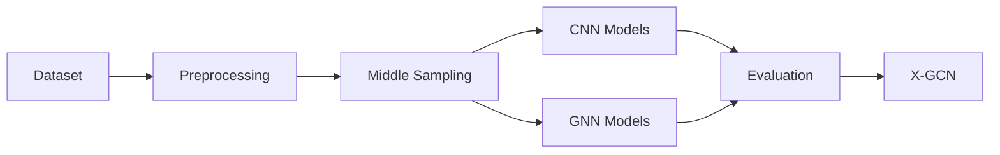

<div align="center">

# 🚀 X-GCN
## *A Micro-Motion Guided Lightweight Graph Neural Network for Efficient Facial Micro-Expression Recognition*

<p>


</p>

</div>

---

# 📖 Project Overview

**X-GCN** is a lightweight **Graph Neural Network (GNN)** designed for **Facial Micro-Expression Recognition (MER)**. The proposed framework utilizes **micro-motion-guided graph representation learning** to efficiently capture subtle facial movements while maintaining low computational complexity.

---

# 🧠 Algorithms

## Convolutional Neural Networks (CNN)

| Model | Release |
|:------|:------:|
| AlexNet | **2012** |
| ResNet | **2015** |
| MobileNet V7 *(Custom)* | **2026** |
| EfficientNet | **2019** |
| Vision Transformer (ViT) | **2020** |
| ConvNeXt | **2022** |

---

## Graph Neural Networks (GNN)

| Model | Release |
|:------|:------:|
| Graph Convolutional Network (GCN) | **2016** |
| Graph Attention Network (GAT) | **2017** |
| Graph Isomorphism Network (GIN) | **2018** |
| GraphEx | **2022** |
| Spatial & Spectral GNN (SSGNN) | **2022** |
| Graph Attention-based MER | **2024** |
| Stochastic GCN (SGCN) | **2024** |
| OFVIG-Net | **2024** |
| SpoT-GCN | **2024** |
| FM-GCN | **2026** |
| <strong>X-GCN (Proposed)</strong> | <strong>2027</strong> |

---

# 📂 Datasets

| Dataset | Purpose |
|----------|---------|
| CASME II | Micro-Expression Recognition |
| CK+ | Facial Expression Recognition |
| SAMM | Spontaneous Micro-Expression Recognition |

> **Note**
>
> All datasets were collected using **Kaggle Hub** and manually verified before conducting experiments to ensure **data authenticity**, **consistency**, and **integrity**.

---

# 💻 Development Environment

### IDE

- Visual Studio Code

### Programming Language

- Python 3.12+

### Deep Learning Framework

- PyTorch
- TorchVision

### Environment

- Conda
- Google Colab

### Database

- MySQL

### Storage

- Google Drive

---

# 🧩 Visual Studio Code Extensions

| Extension |
|-----------|
| Python Extension Pack |
| Code Runner |
| Jupyter Cell Tags |
| Jupyter Keymap |
| Jupyter Notebook Renderers |
| Jupyter Slide Show |
| Python Snippets |
| Prettier |
| SQLTools |
| FastAPI Snippets |
| Bruno |
| Colab |
| Google Colab Keymap |

> **Important**
>
> Install all required software packages, libraries, and dependencies before conducting the experiments.

---

# ⚙️ Experimental Workflow

```text
Dataset Collection
        │
        ▼
 Dataset Verification
        │
        ▼
 Dataset Balancing
 (Middle Sampling)
        │
        ▼
 Data Preprocessing
        │
        ▼
 Store Dataset
 (Google Drive)
        │
        ▼
 Model Training
 (Google Colab)
        │
        ▼
 Hyperparameter Tuning
        │
        ▼
 Save Model Weights
 (MySQL)
        │
        ▼
 Performance Evaluation
        │
        ▼
 Comparison with Existing Models
```

---

# 📝 Experimental Procedure

| Step | Description |
|------|-------------|
| 01 | Collect datasets |
| 02 | Verify dataset authenticity |
| 03 | Balance the dataset using **Middle Sampling** |
| 04 | Perform preprocessing |
| 05 | Store processed datasets in **Google Drive** |
| 06 | Train models using **Google Colab** |
| 07 | Tune hyperparameters |
| 08 | Save trained model weights and metadata |
| 09 | Evaluate model performance |
| 10 | Compare with state-of-the-art methods |

---

# 📊 Research Pipeline



---

# 📌 Project Structure

```text
X-GCN
│
├── Dataset
│   ├── CASME II
│   ├── CK+
│   └── SAMM
│
├── Notebook
│
├── Models
│   ├── CNN
│   └── GNN
│
├── Preprocessing
│
├── Hyperparameters
│
├── Results
│
├── Figures
│
├── Weights
│
└── README.md
```

---

# 📢 Important Notes

> **Experiment Workflow**
>
> The experimental workflow may be modified whenever necessary to satisfy the research objectives.

---

<div align="center">

## ⭐ Proposed Model

# **X-GCN**

*A Micro-Motion Guided Lightweight Graph Neural Network for Efficient Facial Micro-Expression Recognition*

**Expected Release:** **2027**

</div>